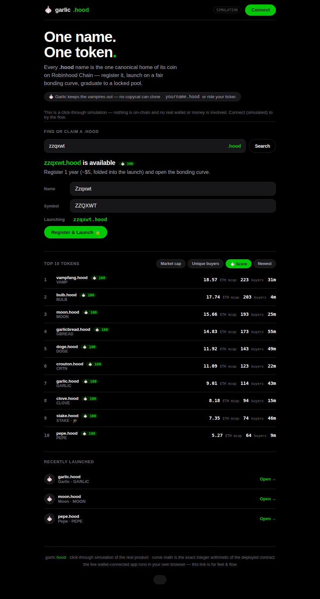

# 🧄 garlic.hood — One Name. One Token.

**A token launchpad for Robinhood Chain where every coin is a unique `.hood` name.**
Register the name, launch on a fair bonding curve, graduate to a locked pool —
and because a `.hood` name can host only one live token, **no copycat can clone
your ticker.** Garlic keeps the vampires out.

> pump.fun proved anyone can launch a token in seconds. garlic.hood launches
> the **one true token for a name** — identity, not just a ticker.



## 🔗 Try the live demo

**[▶ Open the interactive demo](https://raw.githack.com/Omnivalent/clawarcade/1a6bb9d64d41a076014a213c1f56af4a3098c429/hood-launchpad/demo/garlic-site.html)**
— click-through, no wallet needed: search a name, watch the address grind,
trade the bonding curve, walk the name lifecycle, browse the leaderboard, and
see the vampire-name detector in action.

*(The full wallet-connected app that does real testnet transactions is in
[`app/`](app/) — drag that folder onto [Netlify Drop](https://app.netlify.com/drop),
open it, connect a wallet, and click Deploy. No terminal. See
[GO_LIVE_NO_TERMINAL.md](GO_LIVE_NO_TERMINAL.md).)*

## What's inside

- **One-transaction launch** — CREATE2 token deploy + `.hood` registration (1yr,
  custodied so it can't be re-pointed) + bonding-curve listing + fees, atomic.
- **pump.fun tokenomics, ETH-scaled** — 1B supply, 793.1M on the curve, 206.9M
  reserved; graduates on sellout → seeds a Uniswap pool → **LP burned**; the
  name auto-renews +5 years from the raise.
- **Anti-vamp, on-chain + off-chain** — the contract rejects unicode/homoglyph
  labels; the app flags look-alikes ("🧛 80% similar to doge.hood") and scores
  every name with a **Garlic Score** (originality, 100 = unique).
- **Anti-wash leaderboard** — ranks by market cap, **unique buyers**, and Garlic
  Score, not gameable raw volume.
- **Wallet accounts + on-chain social** — SIWE sign-in; your `.hood` is your
  handle; comments are event-only (a few thousand gas).
- **Hardened** — commit-reveal launches (anti-frontrun), graduation renewal with
  a hijack guard, expiry grace period, timelocked registrar swaps, reentrancy
  protection. **29 tests run the real compiled bytecode and pass.**

## Architecture

| Contract | Role |
|---|---|
| `TokenFactory.sol` | One-tx launch, name lifecycle, fees, hardening |
| `BondingCurve.sol` | Singleton virtual-reserve curve; quote = execution; slippage + deadline |
| `LaunchToken.sol` | Minimal ERC-20 — no owner, no mint, no pause (rug-proof) |
| `GarlicRegistry.sol` | **Our own .hood name service** — names as ERC-721 NFTs (expiry, renew, resolver, reverse identity, commit-reveal). No external dependency. |
| `interfaces/INameRegistrar.sol` + `adapters/HoodAgAdapter.sol` | Pluggable adapter — swap in a 3rd-party .hood provider for cross-app interop if one wins |
| `adapters/UniswapV3GraduationHandler.sol` | **Real graduation** — wraps ETH, seeds a v3 pool at the graduation price, **burns the LP position** (locked forever). **DEX-agnostic:** works unchanged with Uniswap v3 **or [SushiSwap CLAMM](https://docs.sushi.com/contracts/clamm)** (a v3 fork with the identical NonfungiblePositionManager ABI) — pick the venue by the addresses you pass in. Wire to Robinhood Chain's addresses + fork-test before mainnet. |
| `CommentBoard.sol` | Event-only social layer |
| `mocks/` | Local registrar / graduation escrow / reentrancy attacker / Uniswap v3 mocks |

See **[docs/MECHANISMS.md](docs/MECHANISMS.md)** for the full deep-dive on the
anti-vamp stack and renewal-on-bond, [PITCH.md](PITCH.md) for the concept &
market, [REVIEW_REQUEST.md](REVIEW_REQUEST.md) for the external-review brief, and
[GO_LIVE_NO_TERMINAL.md](GO_LIVE_NO_TERMINAL.md) to put it live.

## Run the tests

```bash
npm install
node scripts/compile.js   # compile all contracts
node test/evm.test.js         # 29 launchpad end-to-end tests on real bytecode
node test/registry.test.js    # 11 GarlicRegistry (ERC-721 name service) tests
node test/graduation.test.js  # 5 Uniswap v3 graduation-handler tests
node test/curve.test.js       # curve property tests
```

## Status

Testnet-ready and **self-contained** — with `GarlicRegistry` the launchpad
runs its own `.hood` name service (no external provider), and
`UniswapV3GraduationHandler` does the real pool-seed + LP-burn. Before mainnet:
wire the handler to Uniswap v3's Robinhood Chain addresses and **fork-test** a
full graduation, add an events indexer, and get a professional audit.
(Optionally integrate a 3rd-party `.hood` provider later for cross-app name
resolution.) Not investment advice; testnet tokens have no value.
